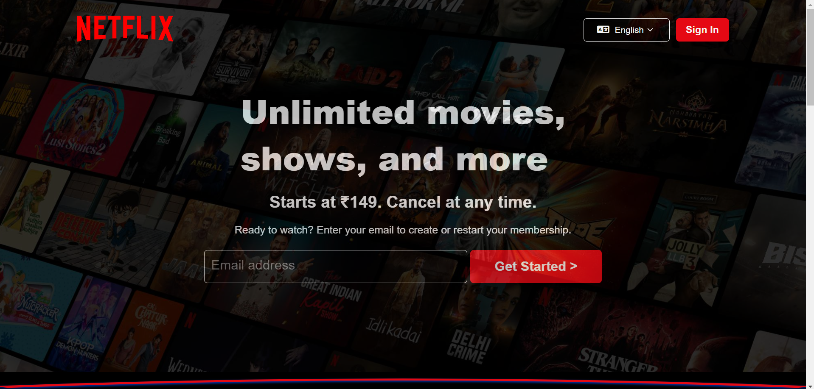
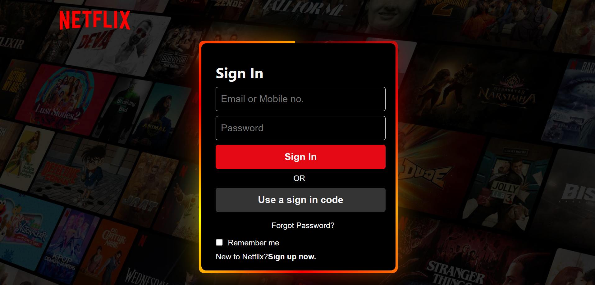
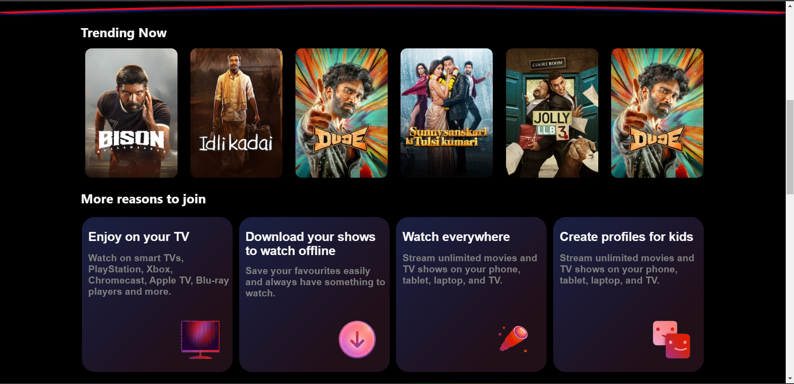

<h1 align="center">🎬 Netflix UI Clone (HTML & CSS)</h1>

<p align="center">
  A clean, modern clone of the Netflix landing page built using only <b>HTML</b> and <b>CSS</b>.
</p>

<p align="center">
  
  
  
  
</p>

---

## 🌐 Live Demo

> 🔗 **Live URL:**[Page Link](https://codewithsuraj33-sketch.github.io/Netflix-Clone/)
> 📸 **Preview:**

<p align="center">
  <!-- Replace this path with your real preview image -->
  
</p>

---

## 📋 Table of Contents

- [About the Project](#-about-the-project)
- [Features](#-features)
- [Tech Stack](#-tech-stack)
- [Project Structure](#-project-structure)
- [Screenshots](#-screenshots)
- [Getting Started](#-getting-started)
- [Usage](#-usage)
- [What I Learned](#-what-i-learned)
- [Future Improvements](#-future-improvements)
- [Contributing](#-contributing)
- [Author](#-author)
- [Acknowledgements](#-acknowledgements)

---

## 🧾 About the Project

This is a **Netflix landing page clone** created using **pure HTML and CSS**.  
The goal of this project was to:

- Practice **layout techniques** like Flexbox and Grid  
- Recreate a **real-world UI** from a popular platform  
- Improve **responsive design** skills  
- Focus on **pixel-perfect design and clean code**

No JavaScript framework, no CSS library – **just handcrafted HTML & CSS.**

---

## ✨ Features

- 🎯 **Hero Section** with background banner and call-to-action buttons  
- 🔑 **Sign In / Sign Up UI** (separate page if you use `signin.html`)  
- 🎞️ **Multiple movie/show rows** inspired by Netflix categories  
- 🧭 **Responsive Navigation Bar** with logo and menu items  
- 📱 **Responsive Design** – works on desktop, tablet, and mobile  
- 🎨 **Hover Effects** on buttons and thumbnails  
- 🖼️ **Dark theme UI** similar to the original Netflix look  

---

## 🛠 Tech Stack

- **HTML5**
- **CSS3**
  - Flexbox
  - CSS Grid (if used)
  - Media Queries for responsiveness
  - Custom utility classes

---

## 📁 Project Structure

    Netflix-Clone/
    ├── index.html        # Main landing page
    ├── signin.html       # Sign in / Sign up page (if used)
    ├── style.css         # Global styles for landing page
    ├── first.css         # Extra / page-specific styles (if used)
    └── assets/           # Images, logos, backgrounds, thumbnails, etc.
        ├── logo.png
        ├── hero-bg.jpg
        ├── preview.png
        └── ...

> 💡 Feel free to update the structure above if your file names are different.

---

## 📸 Screenshots

> Replace the image paths below with your actual image paths inside the `assets` folder.

### 🖥️ Login Page View

<p align="center">
  
</p>

### 📱 Trending Movies Section View

<p align="center">
  
</p>

---

## 🚀 Getting Started

Follow these steps to run the project **locally** on your system.

### ✅ Prerequisites

You only need:

- A modern web browser (Chrome, Edge, Firefox, etc.)
- A code editor (VS Code recommended)

### 📦 Installation

1. **Clone the repository** (ya ZIP download karo):

    ```bash
    git clone https://github.com/<your-username>/<your-repo-name>.git
    ```

2. **Open the project folder** in your editor:

    ```bash
    cd Netflix-Clone
    ```

3. **Run the project:**

   - Simply **double-click** `index.html`  
     **OR**
   - Right-click `index.html` → **Open with** → select your browser  

> 💡 VS Code use karte ho to _Live Server_ extension se bhi chala sakte ho for auto-refresh.

---

## 🧪 Usage

- Open `index.html` in your browser  
- Scroll through the page to explore:
  - Hero banner section
  - Movie rows / content sections
  - Footer and other details
- Open `signin.html` (if implemented) to view the **login / signup design**

This project is mainly for **UI showcase** and **learning purposes** –  
no real authentication or backend is connected.

---

## 📚 What I Learned

While building this Netflix clone, I practiced and improved:

- Structuring semantic **HTML**  
- Creating complex layouts with **Flexbox** (and **Grid** if used)  
- Using **background images**, overlays, and gradients  
- Building **responsive layouts** using media queries  
- Managing **reusable CSS classes** and maintaining clean styles  
- Designing a consistent **dark theme** UI

---

## 🔮 Future Improvements

Some ideas to enhance this project in the future:

- Add **JavaScript** for interactive sliders / carousels  
- Add **scroll animations** and transitions  
- Connect with a **movie API** (like TMDb) to load real content  
- Add a **multi-page experience** for specific shows or movies  
- Implement a **dark/light mode toggle** (experiment project)

---

## 🤝 Contributing

Contributions, issues, and feature requests are welcome!

1. **Fork** the repository  
2. Create a new branch:

    ```bash
    git checkout -b feature/your-feature-name
    ```

3. Make your changes and **commit**:

    ```bash
    git commit -m "Add some feature"
    ```

4. **Push** to your branch:

    ```bash
    git push origin feature/your-feature-name
    ```

5. Open a **Pull Request**

---

## 👨‍💻 Author

**Suraj Adhikary**

- Instagram: [suraj_editz](https://www.instagram.com/suraj_editz.143?utm_source=qr&igsh=M3M5Y3JzMGhkaXQ2)
- Telegram: [Join my channel](https://t.me/codenexa143)
- Youtube: [CodeNexa](https://www.youtube.com/@CodeNexa-143)

If you liked this project, consider giving the repo a ⭐ on GitHub!

---

## 🙏 Acknowledgements

- Original design inspired by **Netflix** UI  
- Icons and logos belong to their respective owners  
- Built with ❤️ using **pure HTML & CSS**

---
